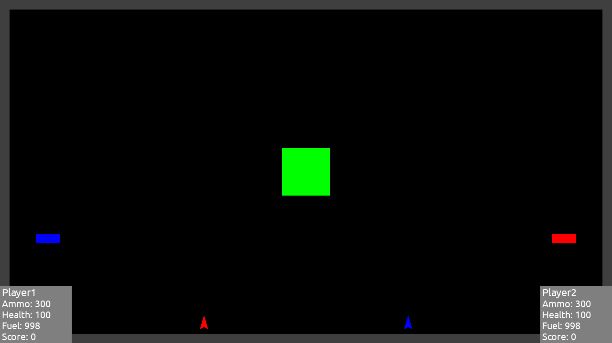

# Mayhem-Clone

A simple two-player space game. Implemented as part of a mandatory assignment in INF-1400 at UiT




## Quick start

```console
$ python3 main.py
```

## Controls:
### Player 1
|Key|Action|
|:---|:---|
| <kbd>W</kbd> | Thrust |
| <kbd>A</kbd> | Rotate left |
| <kbd>D</kbd> | Rotate right |
| <kbd>Space</kbd> | Fire |

### Player 2
|Key|Action|
|:---|:---|
| <kbd>Up</kbd> | Thrust |
| <kbd>Left</kbd> | Rotate left |
| <kbd>Right</kbd> | Rotate right |
| <kbd>Right Ctrl</kbd> | Fire |
